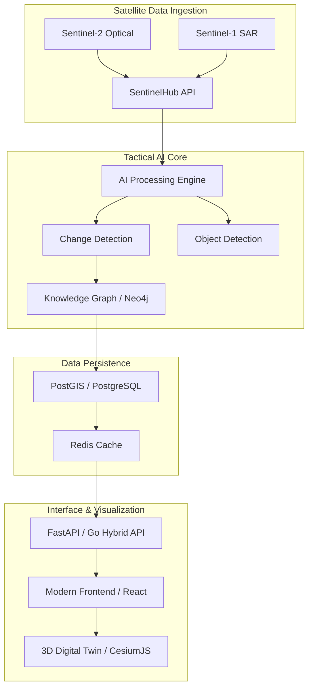

# 🛰️ SentinelX Tactical AI
### *Planetary Intelligence for the Next Era*

[](https://github.com/shafayat83/SentinelX)
[](https://github.com/shafayat83/SentinelX)
[](LICENSE)
[](https://status.sentinelx.ai)

---

## 🌎 Overview

**SentinelX Tactical AI** is a state-of-the-art, multi-modal satellite intelligence platform designed for real-time planetary monitoring and tactical analysis. By fusing high-revisit optical imagery (Sentinel-2) with all-weather Synthetic Aperture Radar (Sentinel-1), SentinelX provides 24/7 visibility into global changes, infrastructure development, and environmental shifts.

Built for scalability and precision, the platform leverages a hybrid **Go/Python** backend, **NEO4J-powered knowledge graphs**, and **3D Digital Twin** visualizations via MapLibre/CesiumJS.

---

## 🚀 Key Capabilities

### 🔷 Multi-Modal Sensor Fusion
*   **Optimal Optical Analysis**: Sentinel-2 (Level 2A) multi-spectral processing for vegetation index (NDVI), water stress, and infrastructure growth.
*   **SAR Penetration**: Sentinel-1 Synthetic Aperture Radar integration for night-time and cloud-covered visibility.
*   **Tactical Change Detection**: Self-supervised Transformer models (Swin-V2) for identifying pixel-level variances between revisits.

### 🔷 High-Performance Real-Time Engine
*   **Go-Powered Streaming**: Distributed backend for low-latency telemetry ingestion.
*   **Task Orchestration**: Celery workers with GPU-affinity for heavy inference pipelines.
*   **Spatial Intelligence**: PostGIS for complex geospatial queries and AOI tracking.

### 🔷 AI-Driven Knowledge Graph
*   **Entity Relation**: Tracking objects across Earth's surface and linking them to a Neo4j-based temporal knowledge graph.
*   **Predictive Analytics**: Forecasting territorial changes based on historical patterns.

---

## 🏗️ System Architecture



---

## 🛠️ Technical Stack

- **Backend**: Python 3.11 (FastAPI), Go 1.21
- **Intelligence**: PyTorch, Swin-Transformer V2, Neo4j
- **Geospatial**: PostGIS, SentinelHub, Mapbox
- **Frontend**: Vite, React, MapLibre GL, Tailwind CSS
- **Infrastructure**: Docker, Kubernetes, Kafka, Redis

---

## ⚡ Quick Start

### 1. Prerequisite Configuration
Ensure you have API credentials for **SentinelHub** and **Mapbox**.

```bash
# Clone the repository
git clone https://github.com/shafayat83/SentinelX.git
cd SentinelX

# Configure environment
cp .env.example .env
# Edit .env with your credentials
```

### 2. Deployment via Docker Compose
One command to spin up the entire tactical stack.

```bash
docker-compose up -d --build
```

Access the dashboard at `http://localhost:3000` and the API documentation at `http://localhost:8000/docs`.

---

## 🗺️ Visionary Roadmap: Phase 3 & Beyond

- [ ] **Starshield Tactical Integration**: Direct low-latency downlink with Starlink-connected ground stations.
- [ ] **On-Orbit Edge Computing**: Deploying lightweight detection models directly to satellite hardware.
- [ ] **Autonomous Drone Coordination**: Triggering real-time drone reconnaissance upon change detection.
- [ ] **High-Fidelity 4D Reconstruction**: Temporal 3D reconstruction of urban environments.

---

## ⚖️ License
Proprietary & Confidential. All rights reserved. 
Inspired by the future of multi-planetary exploration and defense.

---
**"Monitoring Earth to reach the Stars."**
#   S e n t i n e l X 
 
 
